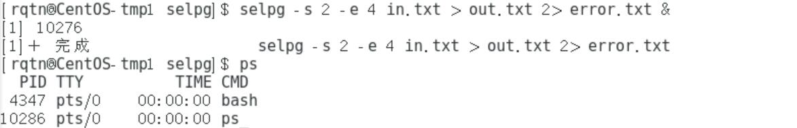

# 服务计算实验：go 语言实现 selpg 命令行实用程序

> 课程实验作业源博客：[CLI 命令行实用程序开发基础](https://pmlpml.github.io/ServiceComputingOnCloud/ex-cli-basic)

**本次服务计算实验的任务是使用 golang 开发博客 —— [开发 Linux 命令行实用程序](https://www.ibm.com/developerworks/cn/linux/shell/clutil/index.html) 中的 selpg。** 在[开发 Linux 命令行实用程序](https://www.ibm.com/developerworks/cn/linux/shell/clutil/index.html)中，作者自己使用 C 语言开发了一个命令行使用程序 selpg，并对其实现过程给予了非常详尽且通俗易懂的讲述。我们的任务就是使用 golang 语言去实现具有同样功能的 selpg。


## 命令格式

```shell
selpg -s start_page -e end_page [-f | -l lines_per_page] [-d dest] [in_filename]
```

`-s` : `-s` 后接正数，表示读取标准输入或文件的开始页数

`-e` : `-e` 后接整数，表示读取标准输入或文件的结尾页数，注意: start_page > 0, end_page > 0 且 end_page >=  start_page

`-f` : 表示以 `\f` 换页符作为标志一页

`-l` : 后接正数，表示一页有多少行。注意：`-f` 和 `-l` 参数指令不能同时出现，默认为-l模式，且默认一页有72行

`-d` : 将选定的页直接发送至打印机。若不存在`-d`参数，则默认为标准输出

`in_filename` : 输入文件。不存在时，默认为标准输入


## 实验测试

> selpg 默认使用 `-l` 方式进行分页，而 `-l` 的默认页行数为 5 行。
>
> `in.txt` 为输入文件，采取 `-l` 方式分页
>
> `in2.txt` 为输入文件，采取 `-f` 方式分页
>
> `out.txt` 为输出文件，用于存放标准输出信息
>
> `error.txt` 为输出文件，用于存放标准错误信息

初始情况下，`in.txt` 内容为：


`in2.txt` 内容为：


`^L` 即表示换页符 `\f`

---

* `selpg -s 1 -e 2 in.txt`


* `selpg -s 1 -e 2 < in.txt`


* `cat -n in.txt | selpg -s 2 -e 3 `


* `selpg -s 1 -e 2 in.txt > out.txt`


* `selpg -s 1 -e 30 in.txt 2> error.txt`


`in.txt` 按照默认的页行数 5 行来算总共只有 6 页。故会报错，报错信息出现在 `error.txt` 上。

* `selpg -s 1 -e 20 in.txt > out.txt 2> error.txt`


* `selpg -s 5 -e 10 in.txt > out.txt 2>/dev/null `


* `selpg -s 3 -e 20 in.txt >/dev/null`


* `selpg -s 1 -e 30 in.txt | wc`


* `selpg -s 1 -e 30 in.txt 2>error.txt | wc`


* `selpg -s 1 -e 2 -l 3 in.txt`


* `selpg -s 1 -e 4 -f in2.txt`


* `selpg -s 1 -e 2 -d lp1 in.txt`


* `selpg -s 2 -e 4 in.txt > out.txt 2> error.txt &`

